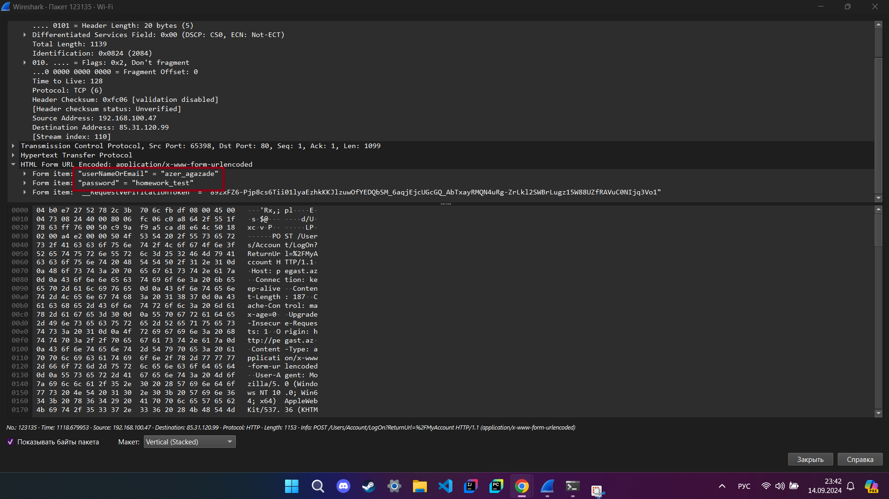

### Задание 1:
Дайте задание студентам найти незашифрованный сайт (подскажите, что можно в гугл настроить соответствующую выдачу по запросу с ключом “-inurl:https” в конце) и перехватить логин/пароль.

Перехваченные логин и пароль указаны в крвсном прямоугольнике.

### Задание 2:
В приложенном файле “The Ultimate PCAP.pcap” найти картинку, какая буква изображена на картинке?

На картинке изображена буква **W**.

