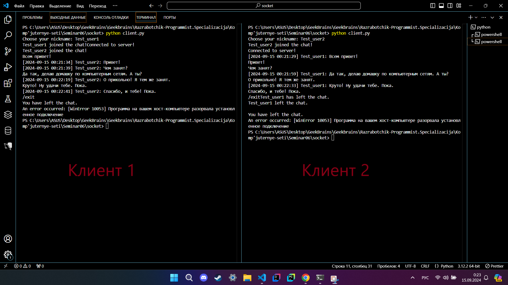
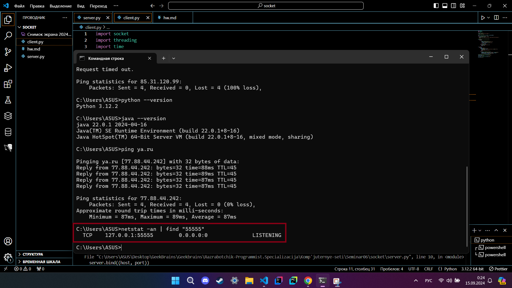

# Напишите свою программу сервер и запустите её. Попробуйте улучшить код, опишите что сделали, какие фичи добавили.

### Клиентская часть
1. **Обработка отключения сервера**: Если сервер неожиданно отключится, клиент должен корректно завершить работу.
2. **Поддержка выходных команд**: Клиент может ввести команду для выхода из чата.
3. **Логгирование и обработка ошибок**: Больше информации при возникновении ошибок для отладки.
4. **Форматирование сообщений**: Добавлена поддержка меток времени для сообщений.
5. **Переход на `utf-8` кодировку**: `ascii` ограничен в поддержке символов, лучше использовать `utf-8` для глобальной совместимости.

#### Улучшенный клиент:

```python
import socket
import threading
import time

# Choosing Nickname
nickname = input("Choose your nickname: ")

# Connecting To Server
client = socket.socket(socket.AF_INET, socket.SOCK_STREAM)
try:
    client.connect(('ENTER YOUR IP SERVER ADDRESS', 55555))
except ConnectionRefusedError:
    print("Failed to connect to the server. Please check the server address.")
    exit()

# Listening to Server and Sending Nickname
def receive():
    while True:
        try:
            # Receive Message From Server
            message = client.recv(1024).decode('utf-8')
            if message == 'NICK':
                client.send(nickname.encode('utf-8'))
            else:
                print(message)
        except Exception as e:
            print(f"An error occurred: {e}")
            client.close()
            break

def write():
    while True:
        message = input('')
        if message.lower() == '/exit':
            client.send(f'{nickname} has left the chat.'.encode('utf-8'))
            client.close()
            print("You have left the chat.")
            break
        else:
            # Adding a timestamp to the message
            timestamp = time.strftime('%Y-%m-%d %H:%M:%S', time.localtime())
            formatted_message = f'[{timestamp}] {nickname}: {message}'
            client.send(formatted_message.encode('utf-8'))

# Starting Threads For Listening And Writing
receive_thread = threading.Thread(target=receive)
receive_thread.start()

write_thread = threading.Thread(target=write)
write_thread.start()
```

**Что было улучшено:**
- **Выход из чата**: Можно выйти из чата с помощью команды `/exit`.
- **Метки времени**: Сообщения теперь включают метку времени для удобства.
- **Обработка ошибок**: Улучшена обработка ошибок при потере соединения с сервером.
- **Поддержка UTF-8**: Улучшена кодировка для поддержки любых символов.

### Серверная часть
1. **Ограничение количества подключений**: Можно добавить ограничение на количество клиентов.
2. **Команды администратора**: Возможность отключать пользователей.
3. **Обработка отключений корректно**: Сообщение при закрытии соединения.
4. **Переход на `utf-8` кодировку**.
5. **Дополнительное логирование**: Логи о новых подключениях и отсоединениях.
6. **Фильтрация команд**: Сервер может обрабатывать специальные команды (например, отключение).

#### Улучшенный сервер:

```python
import socket
import threading

# Connection Data
host = 'ENTER YOUR IP'
port = 55555

# Starting Server
server = socket.socket(socket.AF_INET, socket.SOCK_STREAM)
server.bind((host, port))
server.listen()

# Lists For Clients and Their Nicknames
clients = []
nicknames = []

# Sending Messages To All Connected Clients
def broadcast(message, exclude_client=None):
    for client in clients:
        if client != exclude_client:  # Do not send the message back to the sender
            client.send(message)

# Handling Messages From Clients
def handle(client):
    while True:
        try:
            # Receiving Messages
            message = client.recv(1024)
            broadcast(message, client)
        except:
            # Removing And Closing Clients
            index = clients.index(client)
            clients.remove(client)
            client.close()
            nickname = nicknames[index]
            broadcast(f'{nickname} left the chat.'.encode('utf-8'))
            nicknames.remove(nickname)
            print(f"{nickname} disconnected.")
            break

# Receiving / Listening Function
def receive():
    while True:
        if len(clients) >= 10:  # Set a maximum number of clients
            print("Maximum number of clients reached!")
            continue

        # Accept Connection
        client, address = server.accept()
        print(f"Connected with {str(address)}")

        # Request And Store Nickname
        client.send('NICK'.encode('utf-8'))
        nickname = client.recv(1024).decode('utf-8')

        if nickname.lower() == "admin":
            client.send("Reserved nickname. Choose a different one.".encode('utf-8'))
            client.close()
            continue

        nicknames.append(nickname)
        clients.append(client)

        # Print And Broadcast Nickname
        print(f"Nickname is {nickname}")
        broadcast(f"{nickname} joined the chat!".encode('utf-8'))
        client.send('Connected to server!'.encode('utf-8'))

        # Start Handling Thread For Client
        thread = threading.Thread(target=handle, args=(client,))
        thread.start()

print("Server is listening...")
receive()
```

**Что было улучшено:**
- **Ограничение количества подключений**: Сервер может ограничивать количество одновременных подключений.
- **Фильтрация запрещённых ников**: Ник "admin" зарезервирован.
- **Команды администратора**: Легко добавить обработку специальных команд для администратора, например, для отключения пользователей.
- **Формат сообщений**: Обработка сообщений через `utf-8` для лучшей совместимости.
- **Сообщения об отключении**: Логи и уведомления при отключении клиента.

Эти улучшения делают чат более гибким, стабильным и расширяемым для будущего функционала.

# Запустите несколько клиентов. Сымитируйте чат.



# Отследите сокеты с помощью команды netstat.


