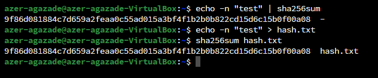
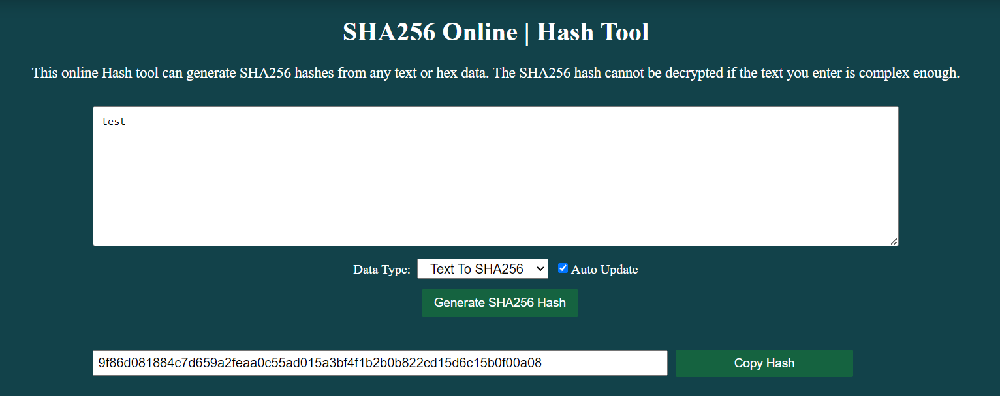
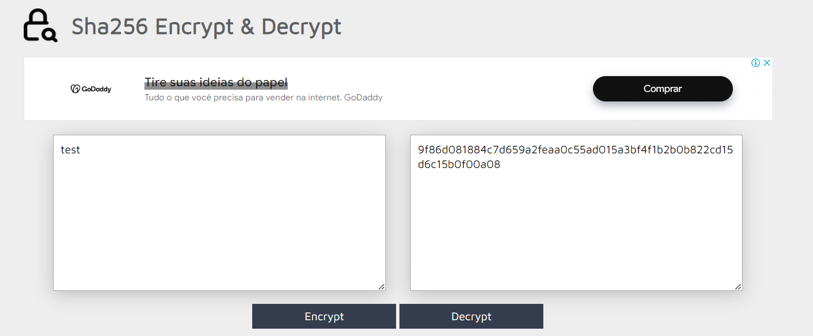

### Задание №3. Расчет и проверка хэшей. Строка (на Ubuntu)
1. Рассчитать хэш SHA-2 (длина хэша 256) для текста («test»):
- в командной строке: echo|set /p="test" > %TMP%/hash.txt |certutil -hashfile
%TMP%/hash.txt SHA256 | findstr /v "hash"
2. Рассчитать хэш SHA-2 (длина хэша 256) для файла с использованием встроенных средств
Linux:
- echo -n test | sha256sum
3. Проверить полученные значения хэшей на веб-ресурсах: https://pi7.org/hash/sha256 и/или
https://md5decrypt.net/en/Sha256/

### 1. Расчет хэша SHA-256 строки «test»:

Мы можем использовать следующую команду:

```bash
echo -n "test" | sha256sum
```

### 2. Расчет хэша SHA-256 для файла с текстом «test»:

Сначала создадим файл с содержимым «test»:

```bash
echo -n "test" > hash.txt
```

Затем рассчитаем хэш SHA-256 для этого файла:

```bash
sha256sum hash.txt
```


### 3. Проверка значений хэшей

После выполнения команд, мы получим значения хэшей SHA-256. Эти значения можно проверить на веб-ресурсах:

- [https://pi7.org/hash/sha256](https://pi7.org/hash/sha256)
- [https://md5decrypt.net/en/Sha256/](https://md5decrypt.net/en/Sha256/)

Просто вставляем полученные хэши на этих сайтах для проверки.


